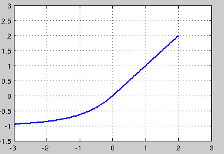

## 激活函数

关于激活函数，首先要搞清楚的问题是，激活函数是什么，有什么用？不用激活函数可不可以？答案是不可以。激活函数的主要作用是提供网络的非线性建模能力。如果没有激活函数，那么该网络仅能够表达线性映射，此时即便有再多的隐藏层，其整个网络跟单层神经网络也是等价的。因此也可以认为，只有加入了激活函数之后，深度神经网络才具备了分层的非线性映射学习能力。 那么激活函数应该具有什么样的性质呢？

可微性： 当优化方法是基于梯度的时候，这个性质是必须的。 
单调性： 当激活函数是单调的时候，单层网络能够保证是凸函数。 
输出值的范围： 当激活函数输出值是 有限 的时候，基于梯度的优化方法会更加 稳定，因为特征的表示受有限权值的影响更显著;当激活函数的输出是 无限 的时候，模型的训练会更加高效，不过在这种情况小，一般需要更小的learning rate

从目前来看，常见的激活函数多是分段线性和具有指数形状的非线性函数

### sigmoid

$$f(x)=\frac{1}{1+e^{−x}}$$

sigmoid 是使用范围最广的一类激活函数，具有指数函数形状，它在物理意义上最为接近生物神经元。此外，(0, 1) 的输出还可以被表示作概率，或用于输入的归一化，代表性的如Sigmoid交叉熵损失函数。

然而，sigmoid也有其自身的缺陷，最明显的就是饱和性。从上图可以看到，其两侧导数逐渐趋近于0 

$$\lim_{n \to \infty}f'(x)=0$$

具有这种性质的称为软饱和激活函数。具体的，饱和又可分为左饱和与右饱和。与软饱和对应的是硬饱和, 即 

$$f′(x)=0，当 |x| > c，其中c为常数。$$

$sigmoid$ 的软饱和性，使得深度神经网络在二三十年里一直难以有效的训练，是阻碍神经网络发展的重要原因。具体来说，由于在后向传递过程中，sigmoid向下传导的梯度包含了一个 $f′(x)$ 因子（sigmoid关于输入的导数），因此一旦输入落入饱和区，$f′(x)$ 就会变得接近于0，导致了向底层传递的梯度也变得非常小。此时，网络参数很难得到有效训练。这种现象被称为梯度消失。一般来说， $sigmoid$ 网络在 5 层之内就会产生梯度消失现象

此外，sigmoid函数的输出均大于0，使得输出不是0均值，这称为偏移现象，这会导致后一层的神经元将得到上一层输出的非0均值的信号作为输入。

### tanh

$$f(x)=\frac{1−e^{−2x}}{1+e^{−2x}}$$

tanh也是一种非常常见的激活函数。与sigmoid相比，它的输出均值是0，使得其收敛速度要比sigmoid快，减少迭代次数。然而，从途中可以看出，tanh一样具有软饱和性，从而造成梯度消失。

### ReLU，P-ReLU, Leaky-ReLU

$$
 f(x)=\begin{cases}
 x, if x \ge 0 \\ 
 0, if x \lt 0
 \end{cases}
$$

$$f(x)=max(0,x)$$

ReLU的全称是Rectified Linear Units，是一种后来才出现的激活函数。 可以看到，当x\<0时，ReLU硬饱和，而当x\>0时，则不存在饱和问题。所以，ReLU 能够在x\>0时保持梯度不衰减，从而缓解梯度消失问题。这让我们能够直接以监督的方式训练深度神经网络，而无需依赖无监督的逐层预训练。

然而，随着训练的推进，部分输入会落入硬饱和区，导致对应权重无法更新。这种现象被称为“神经元死亡”。与sigmoid类似，ReLU的输出均值也大于0，偏移现象和 神经元死亡会共同影响网络的收敛性。

针对在$x<0$的硬饱和问题，我们对ReLU做出相应的改进，使得 
$$
 f(x)=\begin{cases}
 x, if x \ge 0 \\ 
 ax, if x \lt 0
 \end{cases}
$$

这就是Leaky-ReLU, 而P-ReLU认为，αα也可以作为一个参数来学习，原文献建议初始化a为0.25，不采用正则。

### ELU

$$
 f(x)=\begin{cases}
 x, if x \ge 0 \\ 
 \alpha(e^x-1), if x \lt 0
 \end{cases}
$$

融合了sigmoid和ReLU，左侧具有软饱和性，右侧无饱和性。右侧线性部分使得ELU能够缓解梯度消失，而左侧软饱能够让ELU对输入变化或噪声更鲁棒。ELU的输出均值接近于零，所以收敛速度更快。在 ImageNet上，不加 Batch Normalization 30 层以上的 ReLU 网络会无法收敛，PReLU网络在MSRA的Fan-in （caffe ）初始化下会发散，而 ELU 网络在Fan-in/Fan-out下都能收敛

### Maxout

## 

$$f(x)=max(w^T_1x+b_1,w^T_2x+b_2,⋯,w^T_n+b_n)$$

在我看来，这个激活函数有点大一统的感觉，因为maxout网络能够近似任意连续函数，且当$w_2,b_2,…,w_n,b_n$为0时，退化为ReLU。Maxout能够缓解梯度消失，同时又规避了ReLU神经元死亡的缺点，但增加了参数和计算量。